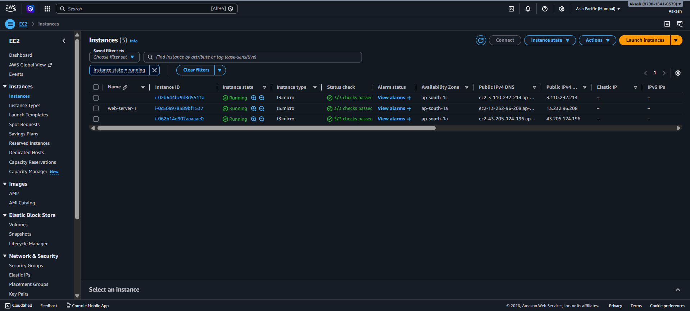
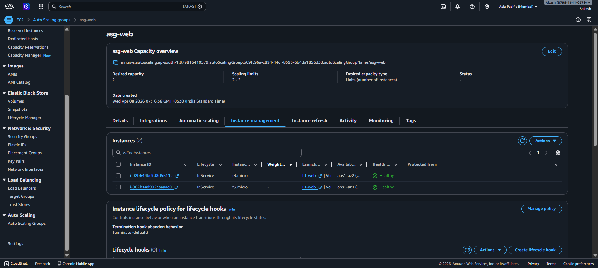
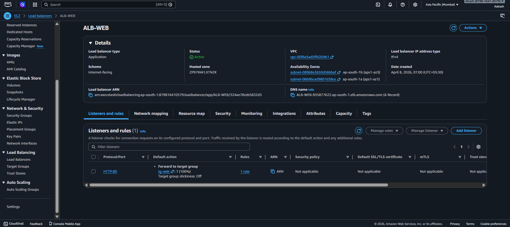
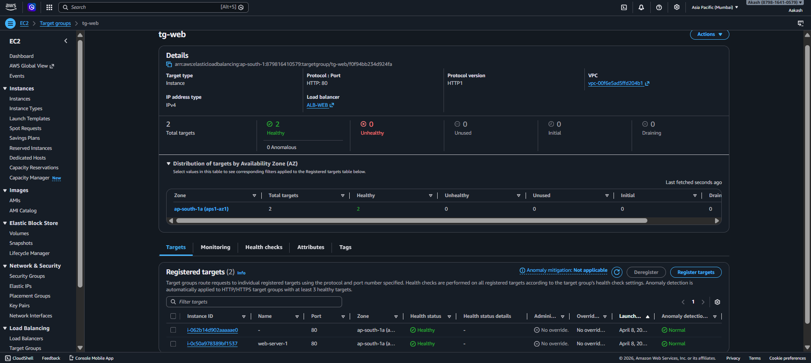
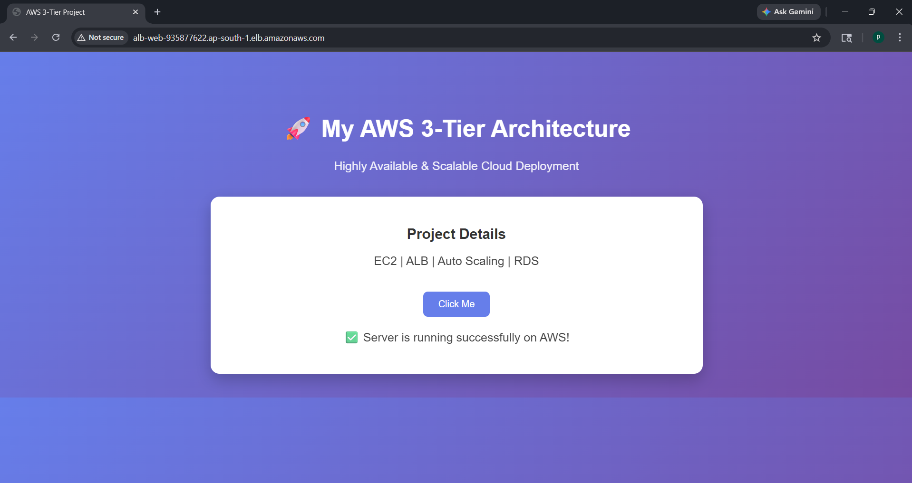
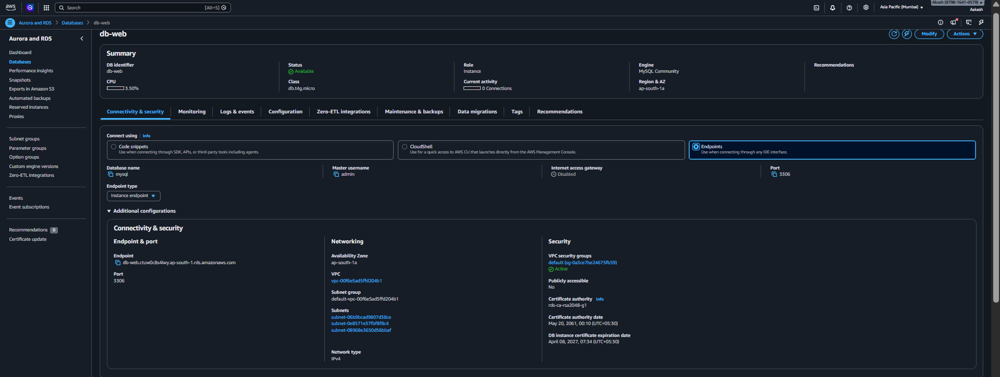
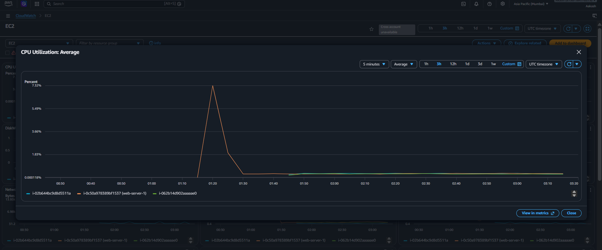

# 🚀 AWS 3-Tier High Availability Architecture

## 📌 Overview

Designed and deployed a production-ready highly available 3-tier architecture on AWS using EC2, ALB, Auto Scaling, RDS, and CloudWatch.

## 🏗️ Architecture

User → Application Load Balancer → EC2 (Auto Scaling) → RDS

## 🧰 Services Used

* Amazon EC2
* Application Load Balancer (ALB)
* Auto Scaling Group
* Amazon RDS (MySQL)
* Amazon VPC
* AWS IAM
* Amazon CloudWatch

## 📸 Project Screenshots

### EC2 Instances

### Auto Scaling Group

### Load Balancer

### Target Group

### Final Output

### RDS Database

### CloudWatch Monitoring

## 💡 Key Features

* High availability with Auto Scaling
* Load balancing using ALB
* Secure database deployment
* Monitoring using CloudWatch

## 👨‍💻 Author

Akash
